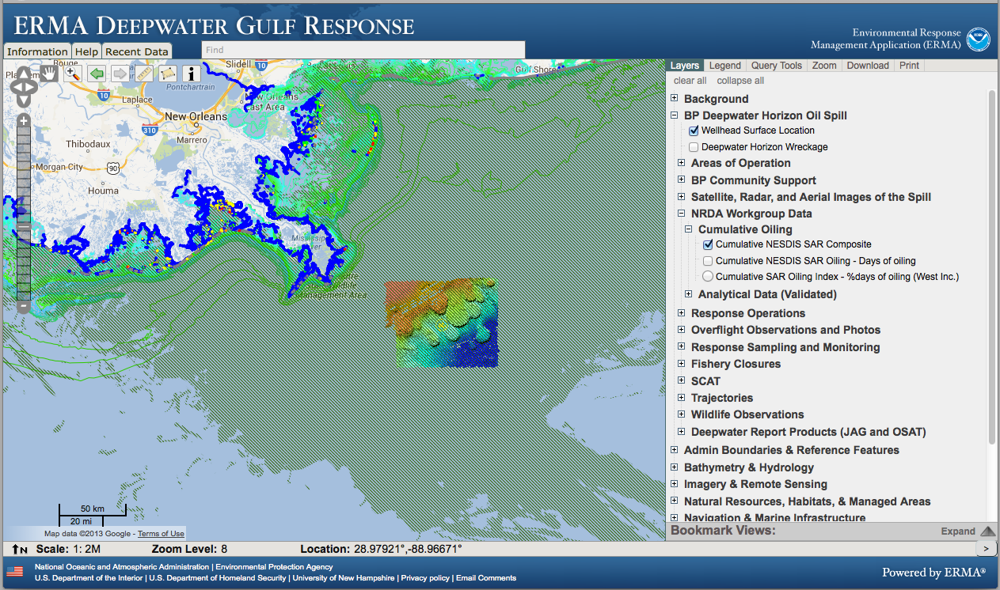
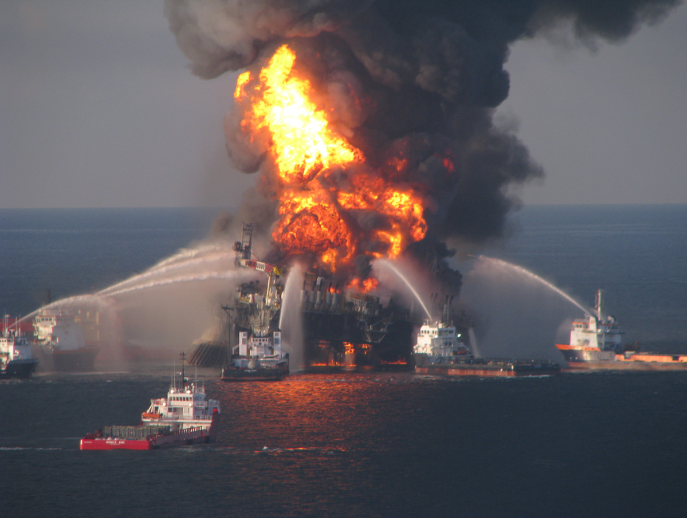
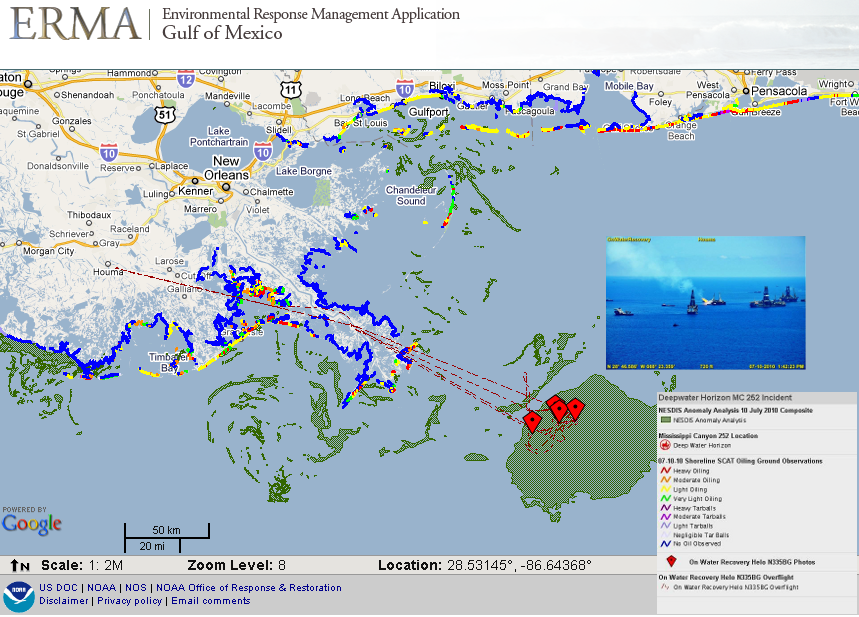

<!------------------------------------------------------------>
<!--              ERMA - CoastGIS 2013                      -->
<!------------------------------------------------------------>

<!------------------------------------------------------------>
<!-- Topic: Title slide -->

<!--img src="images/NOAA_logo.png"-->

<h2>ERMA<small>&reg;</small> - NOAA driving next generation environmental response</h2>

    <small>Aaron Racicot - <a href="mailto:aaron.racicot@noaa.gov">aaron.racicot@noaa.gov</a>
 
<a href="http://reprojected.com">reprojected.com</a> / <a href="http://twitter.com/reprojected">@reprojected</a> / <a href="https://github.com/aaronr">github.com/aaronr</a></small>

<!------------------------------------------------------------>
--SLIDE--
<!-- Topic: Introduce myself -->

<h1>Who I am?</h1>

<ul>
  <li class="fragment"><strong>SW Developer</strong></li>
  <li class="fragment"><strong>Environmental Scientist</strong></li>
  <li class="fragment"><strong>Open Source Advocate</strong></li>
</ul>

--SUBSLIDE--

  <h3>Computer Science</h3>
  <h2>Bridging the Gap</h2>
  <h3>Environmental Science</h3>

<!------------------------------------------------------------>
--SLIDE--
<!-- Topic: Introduce not only NOAA, but ORR as well -->

<h1>OR&R</h1>

<!------------------------------------------------------------>
--SLIDE--
<!-- Topic: Re-itterate the conf theme... and loop in how NOAA and ORR fit -->

<h1>Monitoring and Adapting to Change on the Coast</h1>

--SUBSLIDE--

<h1>NOAA</h1>
<ul>
  <li><strong>Monitoring = Sort-Long Term, Weather, Oceanography, ...</strong></li>
  <li><strong>Adapting = Policy, Science, Boots on the Ground, ...</strong></li>
  <li><strong>Change = Natural, Human Influence, ...</strong></li>
</ul>

--SUBSLIDE--

<h1>ERMA at OR&R</h1>
<ul>
  <li><strong>Monitoring = Real-Time monitoring</strong></li>
  <li><strong>Adapting = Staying agile (people, tools, ...)</strong></li>
  <li><strong>Change = The unexpected</strong></li>
</ul>

<!------------------------------------------------------------>
--SLIDE--
<!-- Topic: Why I am here... DWH and ERMA+TEAM -->

<h2>The ERMA application and team</h2>

--SUBSLIDE--

<h2>The Deepwater Horizon experience</h2>

<!------------------------------------------------------------>
--SLIDE--
<!-- Topic: ERMA intro -->

<h1>Our little project...</h1>

<ul style="list-style: none;">
  <li><h2>Environmental</h2></li>
  <li><h2>Response</h2></li>
  <li><h2>Management</h2></li>
  <li><h2>Application</h2></li>
</ul>

<!------------------------------------------------------------>
--SLIDE--
<!-- Topic: What is ERMA... user app, but complex system -->

<h2>What is ERMA?</h2>

--SUBSLIDE--

<!------------------------------------------------------------>
--SLIDE--
<!-- Topic: ERMA history... visual -->

<h2>History</h2>

<!------------------------------------------------------------>
--SLIDE--
<!-- Topic: Lead in to DWH -->

<h1>DWH</h1>

<!------------------------------------------------------------>
--SLIDE--
<!-- Topic: DWH Stats -->

<h1>DWH - Statistics</h1>

* 11 men perished
* 200+ million gallons of oil spilled
* 580+ miles of shoreline oiled
* 1.70+ million gallons dispersants applied
* 400+ controlled burns
* 4+ million feet of containment boom and 9+ million feet of sorbent boom

<!------------------------------------------------------------>
--SLIDE--
<!-- Topic: DWH in images -->

--SUBSLIDE--

--SUBSLIDE--

--SUBSLIDE--

--SUBSLIDE--

<!------------------------------------------------------------>
--SLIDE--
<!-- Topic: ERMAs involvement with DWH -->

<h1>DWH and ERMA</h1>

* Over 180 Individual Federal/State GIS Staff
* 30-40 specifically ERMA (up from 4 normally)
* 3 ERMA developers

<!------------------------------------------------------------>
--SLIDE--
<!-- Topic: The ORR continuum -->

<h1>The ORR Continuum</h1>
<h2>Response > Assessment > Restoration</h1>

<!------------------------------------------------------------>
--SLIDE--
<!-- Topic: Explanation of the COP -->

<h2>COP</h2>

--SUBSLIDE--

--SUBSLIDE--

<!------------------------------------------------------------>
--SLIDE--
<!-- Topic: How ERMA shines as COP -->

<h1>ERMA Shines</h1>
<ul>
  <li class="fragment"><strong>Less than 48 hours to deploy</strong></li>
  <li class="fragment"><strong>Scalable – 1400+ response users, 16,000+ layers (DWH)</strong></li>
  <li class="fragment"><strong>25,000+ layers today</strong></li>
  <li class="fragment"><strong>Nimble – over 850 code commits in DWH first year</strong></li>
  <li class="fragment"><strong>Public ERMA – over 20 million hits in 24 hours!</strong></li>
</ul>

<!------------------------------------------------------------>
--SLIDE--
<!-- Topic: ERMA screenshots showing diverse capability -->

--SUBSLIDE--

--SUBSLIDE--

--SUBSLIDE--

--SUBSLIDE--

--SUBSLIDE--

<!------------------------------------------------------------>
--SLIDE--
<!-- Topic: Next on the continuum -->

<h2>Response > Assessment > Restoration</h2>
<h3>(Where we are now)</h3>

<!------------------------------------------------------------>
--SLIDE--
<!-- Topic: Explain NRDA... in a discrete way -->

<h1>What is NRDA?</h1>
<small><a href="http://www.gulfspillrestoration.noaa.gov/assessment/">www.gulfspillrestoration.noaa.gov/assessment</a></small>
<h2>Natural Resource Damage Assessment</h2>
<ul>
  <li><strong>Field data collection</strong></li>
  <li><strong>TWGs (technical working groups)</strong></li>
  <li><strong>Archival, aggregation, and visualization of data</strong></li>
  <li><strong>Support ongoing court cases</strong></li>
</ul>

--SUBSLIDE--

<!------------------------------------------------------------>
--SLIDE--
<!-- Topic: Show LQ as example of query in NRDA -->

--SUBSLIDE--

--SUBSLIDE--

<!------------------------------------------------------------>
--SLIDE--
<!-- Topic: Next in the continuum -->

<h2>Response > Assessment > Restoration</h2>

<!------------------------------------------------------------>
--SLIDE--
<!-- Topic: Showing some visuals and stats of restoration -->

<h2>Future project planning and tracking</h2>

--SUBSLIDE--

<!------------------------------------------------------------>
--SLIDE--
<!-- Topic: Moving to the bigger picture... ERMA national -->

<h2>National Coverage - Regional ERMA's</h2>

<!------------------------------------------------------------>
--SLIDE--
<!-- Topic: Big pushes forward -->

<h2>Continued push toward multi-agency</h2>
<h2>cooperation and data sharing</h2>

<h2>Scaling in new ways</h2>
<h2>(leveraging the cloud)</h2>

<!------------------------------------------------------------>
--SLIDE--
<!-- Topic: Arctic as a new regional example -->

<h1>Arctic</h1>

--SUBSLIDE--

<!------------------------------------------------------------>
--SLIDE--
<!-- Topic: Sandy as a non-DWH incident example -->

<h2>Hurricanes (Isaac)</h2>

<!------------------------------------------------------------>
--SLIDE--
<!-- Topic: Loop around to the attendees... how does this matter? -->

<h2>So how/why does this matter to you?</h2>

<!------------------------------------------------------------>
--SLIDE--
<!-- Topic: The key is the philosophy -->

<h2>The nuts and bolts might not...</h2>
<h1>the philosophy does</h1>

--SUBSLIDE--

<h2>Focus on small teams of experts</h2>

--SUBSLIDE--

<h2>Leverage open tools,</h2>
<h2>but own the deployment</h2>
<ul>
  <li><strong>This gives us the benefit of a large community of developers</strong></li>
  <li><strong>This gives us the freedom modify and adapt when needed</strong></li>
</ul>

--SUBSLIDE--

<h2>Utilize open data</h2>
<h2>and open standards</h2>
<ul>
  <li><strong>We use OGC standards based data transfer</strong></li>
  <li><strong>We use OSM (Open Street Map)</strong></li>
  <li><strong>Browser tech that is compatible with older browsers (USCG)</strong></li>
</ul>

<!------------------------------------------------------------>
--SLIDE--
<!-- Topic: ERMA is an example... hopefully a good one to follow -->

<h1>What is making ERMA successful?</h1>
<ul>
  <li><strong>Small distributed team... hand picked experts</strong></li>
  <li><strong>Core team at OR&R - Scientists and data managers</strong></li>
  <li><strong>On-site training/participation</strong></li>
  <li><strong>Unique Features:</strong></li>
  <ul>
    <li><strong>Dynamic web-based upload</strong></li>
    <li><strong>Full styling control by users</strong></li>
    <li><strong>Fine grained permissions - One interface, many agencies</strong></li>
  </ul>
  <li><strong>Make ERMA easy to use</strong></li>
</ul>

<!------------------------------------------------------------>
--SLIDE--
<!-- Topic: A byproduct, not the reason... it saves money -->

<h1>Doing more with less</h1>
<h2>(This is a good investment for NOAA)</h2>

<!------------------------------------------------------------>
--SLIDE--
<!-- Topic: The crystal ball... the future -->

<h1>ERMA's Future?</h1>
<ul>
  <li class="fragment"><strong>Scale</strong></li>
  <li class="fragment"><strong>Deep integration across agencies</strong></li>
  <li class="fragment"><strong>Mobile</strong></li>
  <li class="fragment"><strong>Stand-Alone instances with sync</strong></li>
</ul>

<!------------------------------------------------------------>
--SLIDE--
<!-- Topic: The crystal ball... the future -->

<h1>Future of response?</h1>
<ul>
  <li class="fragment"><strong>There will be more spills</strong></li>
  <li class="fragment"><strong>There will be more hurricanes</strong></li>
  <li class="fragment"><strong>There will be more tsunamis</strong></li>
  <li class="fragment"><strong>Things will be BIGGER and more frequent</strong></li>
</ul>

<!------------------------------------------------------------>
--SLIDE--
<!-- Topic: The keys to the kingdom -->

<h1>Key to the future?</h1>
<ul>
  <li class="fragment"><strong>Build nimble, open, and scalable tools...</strong></li>
  <li class="fragment"><strong>Talk together via open protocols...</strong></li>
  <li class="fragment"><strong>The right data (both open and closed)...</strong></li>
  <li class="fragment"><strong>The right dedicated people behind them...</strong></li>
</ul>

<!------------------------------------------------------------>
--SLIDE--
<!-- Topic: Thank You -->

<h1>Thank You !!!</h1>

<!------------------------------------------------------------>
--SLIDE--
<!-- Topic: Credits -->

<h1>Acknowledgements</h1>

--SUBSLIDE--

<h4>Dr. Amy Merten, Spatial Data Branch Chief</h4>
<h4><small>amy.merten@noaa.gov</small></h4>
<h4>Michele Jacobi, ERMA Technical Team Lead</h4>
<h4><small>michele.jacobi@noaa.gov</small></h4>
<h4>George Graettinger, Gulf of Mexico Regional Lead</h4>
<h4><small>george.graettinger@noaa.gov</small></h4>
<h4>Benjamin Shorr</h4>
<h4><small>benjamin.shorr@noaa.gov</small></h4>
<h4>Kari Sheets</h4>
<h4><small>kari.sheets@noaa.gov</small></h4>
<h4>Jill Bodnar</h4>
<h4><small>jill.bodnar@noaa.gov</small></h4>

--SUBSLIDE--

<h2>Funding Sources</h2>
<h4>Coastal Response Research Center</h4>
<h4>US EPA Region II</h4>
<h4>U.S. Coast Guard</h4>
<h4>NOAA’s Office of Response and Restoration</h4>
<h4>Coastal Storms Program</h4>
<h4>DOI/Bureau of Safety and Environmental Enforcement</h4>
<h4>Oil Spill Recovery Institute</h4>

--SUBSLIDE--

<h2>Developers</h2>
<h4>Aaron Racicot, Z-Pulley</h4>
<h4>Chander Ganesan, OTG</h4>
<h4>Robert St. Lawrence, UNH</h4>
<h4>Phillip Collins, UNH</h4>
<h4>David Bitner, DBSpatial</h4>
<h4>Dan Little, DBSpatial</h4>
<h4>Allison Bailey, SoundGIS</h4>

